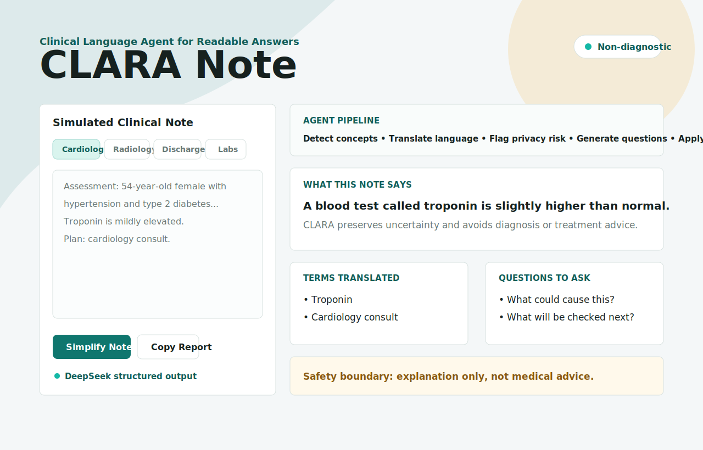

# CLARA Note

**Clinical Language Agent for Readable Answers**

CLARA Note is a safety-aware clinical language agent powered by DeepSeek V4. It turns simulated medical notes into plain-language explanations, flags uncertainty and possible privacy risks, and helps patients, caregivers, or medical AI students prepare better questions for clinicians.

It is designed as a responsible medical AI portfolio project. It does not diagnose, recommend treatment, or replace a licensed clinician.



## What It Does

- Simplifies simulated clinical notes into readable language
- Explains clinical terms
- Flags uncertainty in the note
- Detects obvious fake PHI patterns such as names, phone numbers, MRNs, emails, and exact dates
- Generates questions to ask a clinician
- Supports patient, caregiver, and student explanation modes
- Uses a local deterministic fallback when no backend or API key is available
- Calls DeepSeek V4 through an OpenAI-compatible API, with local deterministic fallback support


## Architecture

```text
Browser UI
  -> FastAPI backend (/api/simplify)
    -> guardrails and PHI checks
    -> DeepSeek V4 structured JSON generation
    -> output safety review
    -> response normalization and safety fallback
```

The frontend never stores API keys. LLM credentials are read only by the backend from environment variables or a local `.env` file.

## Safety Design

CLARA Note uses three layers of safety controls:

- Pre-checks for obvious PHI patterns and high-risk language
- A non-diagnostic system prompt that forbids treatment recommendations
- Output safety review that flags diagnostic wording, treatment advice, missing uncertainty, and missing non-diagnostic boundaries
- Response normalization plus fallback rules when model output is incomplete or unavailable

## Project Structure

```text
.
├── index.html
├── styles.css
├── script.js
├── clara_agent/
│   ├── api.py
│   ├── guardrails.py
│   ├── llm.py
│   ├── rule_engine.py
│   └── safety_review.py
├── evals/
│   ├── run_evals.py
│   └── sample_notes.json
├── tests/
├── render.yaml
├── netlify.toml
├── requirements.txt
└── requirements-dev.txt
```

## Run Static Demo

```bash
python3 -m http.server 8000
```

Open:

```text
http://localhost:8000
```

The static demo works without an API key. It uses the browser-side fallback rules.

## Run Backend

Install dependencies:

```bash
python3 -m venv .venv
source .venv/bin/activate
pip install -r requirements-dev.txt
```

Start the API:

```bash
uvicorn clara_agent.api:app --port 8001
```

The frontend will automatically try:

```text
http://localhost:8001/api/simplify
```

If the backend is unavailable, it falls back to local rules.

## Optional LLM Setup

Create a `.env` file or export variables in your shell:

```bash
export OPENAI_API_KEY="your_api_key"
export OPENAI_MODEL="gpt-4o-mini"
```

The backend loads `.env` automatically when `python-dotenv` is installed. If no API key is configured, or if the API call fails, CLARA Note returns a deterministic local fallback.

### DeepSeek V4 Setup

DeepSeek V4 is available through an OpenAI-compatible Chat Completions API. Create a `.env` file:

```bash
CLARA_LLM_PROVIDER=deepseek
CLARA_LLM_BASE_URL=https://api.deepseek.com
CLARA_LLM_API_KEY="your_deepseek_key"
CLARA_LLM_MODEL="deepseek-v4-flash"
```

For higher capability, use `deepseek-v4-pro` instead of `deepseek-v4-flash`. Then restart the backend:

```bash
uvicorn clara_agent.api:app --port 8001
```

### GPTsAPI Setup

GPTsAPI is OpenAI-compatible, so CLARA Note can call it through the Chat Completions endpoint. Create a `.env` file:

```bash
CLARA_LLM_PROVIDER=gptsapi
CLARA_LLM_BASE_URL=https://api.gptsapi.net/v1
CLARA_LLM_API_KEY="your_gptsapi_key"
CLARA_LLM_MODEL="gpt-4o-mini"
```

Then restart the backend:

```bash
uvicorn clara_agent.api:app --port 8001
```

You can also export the variables directly in your shell instead of using `.env`.


## Deployment Configuration

The frontend API URL is configurable at runtime. In `index.html`, set `window.CLARA_API_BASE_URL` before loading `script.js`:

```html
<script>
  window.CLARA_API_BASE_URL = "https://your-backend.example.com";
</script>
```

The backend CORS allowlist is configured with a comma-separated environment variable:

```bash
export CLARA_CORS_ORIGINS="https://your-frontend.example.com,http://localhost:8000"
```

For deployment, keep `CLARA_LLM_API_KEY` only on the backend host. Never expose it in frontend code.

### Render Backend

This repo includes `render.yaml` for a Render web service. Create a new Render Blueprint from the GitHub repo, then set these environment variables in Render:

```bash
CLARA_LLM_API_KEY=your_deepseek_key
CLARA_CORS_ORIGINS=https://your-netlify-site.netlify.app
```

`CLARA_LLM_PROVIDER`, `CLARA_LLM_BASE_URL`, and `CLARA_LLM_MODEL` are already defined in `render.yaml`.

### Netlify Frontend

This repo includes `netlify.toml` for static frontend hosting. After the backend URL is available, set `window.CLARA_API_BASE_URL` in `index.html` to the deployed backend origin, for example:

```html
<script>
  window.CLARA_API_BASE_URL = "https://clara-note-api.onrender.com";
</script>
```

Then deploy the repository to Netlify with publish directory `.`.

## API

```http
POST /api/simplify
Content-Type: application/json
```

Request:

```json
{
  "note": "Troponin is mildly elevated. Plan: trend troponins and cardiology consult.",
  "audience": "patient",
  "use_llm": true
}
```

Response:

```json
{
  "plain_summary": "...",
  "terms": [{ "term": "Troponin", "explanation": "..." }],
  "questions": ["..."],
  "uncertainties": ["..."],
  "safety_flags": [{ "label": "Uncertain wording", "level": "warning" }],
  "agent_steps": ["Detect clinical concepts", "..."],
  "mode": "patient",
  "source": "local_rules",
  "review_flags": [],
  "fallback_reason": ""
}
```

## Safety Boundary

CLARA Note is limited to explanation and communication support:

- It does not diagnose.
- It does not recommend treatment.
- It does not tell users to start, stop, or change medication.
- It does not verify whether a clinical note is complete or correct.
- It should be used only with simulated or de-identified text.

## Tests

```bash
pytest
```

Run lightweight safety evals:

```bash
python evals/run_evals.py
python evals/run_evals.py --backend-url http://localhost:8001/api/simplify
python evals/run_evals.py --backend-url http://localhost:8001/api/simplify --use-llm
```

Without installing dev dependencies, you can still run a basic syntax check:

```bash
python3 -m compileall clara_agent
node --check script.js
```

## Portfolio Description

> CLARA Note is a safety-aware clinical language agent that translates simulated medical notes into readable explanations, flags uncertainty and possible privacy risks, and helps users prepare better clinician questions without providing diagnosis or treatment advice.

## License

MIT License. See [LICENSE](LICENSE).
